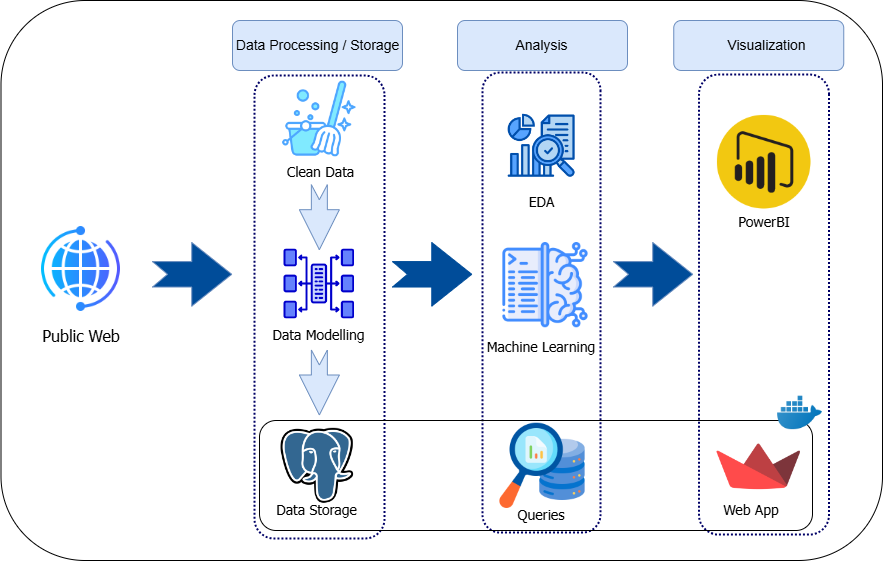
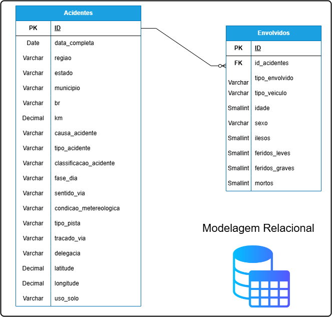

## Projeto Acidentes em Rodovias Federais

### Objetivo

O objetivo deste projeto é analisar os dados de acidentes em rodovias federais do Brasil, disponibilizados pela Polícia Rodoviária Federal (PRF), com o intuito de identificar padrões e características dos acidentes, bem como as possíveis causas e consequências. A análise dos dados será realizada Python e suas bibliotecas para análise de dados, como Pandas, Numpy, Matplotlib, plotly, e sklearn para machine learning.

### Tecnologias Utilizadas 🔧

- Python (Pandas, Numpy, Matplotlib, Plotly, Sklearn, streamlit, etc)
- Docker
- PostgreSQL
- PowerBI
- Git

### Pipeline

1. **Coleta de Dados**

Os dados foram coletados diretamente do site da PRF, disponíveis em: https://portal.prf.gov.br/dados-abertos-acidentes. O dataset utilizado é referente ao ano de 2020 a 2023, e contém informações sobre os acidentes ocorridos nas rodovias federais do Brasil.

2. **Limpeza e Pré-processamento**

Nesta etapa, os dados foram tratados e limpos, removendo valores nulos, duplicados e outliers. Além disso, foram realizadas transformações e ajustes necessários para a análise.

3. **Modelagem de dados**

Os dados foram modelados e importados para o banco de dados PostgreSQL, utilizando o docker para a criação do container. Em seguida, foram realizadas consultas SQL para a extração de informações relevantes.

4. **Análise Exploratória**

A análise exploratória dos dados foi realizada com o intuito de identificar padrões e características dos acidentes, bem como as possíveis causas e consequências. Foram utilizadas técnicas de visualização de dados para facilitar a interpretação dos resultados.

5. **Machine Learning**

Foi aplicado um modelo de machine learning para prever a gravidade dos acidentes, com base nas características dos acidentes. Para isso, foram utilizadas técnicas de pré-processamento de dados, seleção de features e treinamento do modelo.

6. **Storytelling**

Por fim, os resultados obtidos foram apresentados utilizando streamlit e PowerBI para a criação de dashboards interativos, facilitando a visualização e interpretação dos dados.

