## Projeto Acidentes em Rodovias Federais

### Objetivo

O objetivo deste projeto é analisar os dados de acidentes em rodovias federais do Brasil, disponibilizados pela Polícia Rodoviária Federal (PRF), com o intuito de identificar padrões e características dos acidentes, bem como as possíveis causas e consequências. A análise dos dados será realizada Python e suas bibliotecas para análise de dados, como Pandas, Numpy, Matplotlib, plotly, e sklearn para machine learning.

[Aplicação Web](https://acidentes-rodovias-federais.streamlit.app/)

### Tópicos

- [Tecnologias](#Tecnologias-Utilizadas-🔧)
- [Pipeline](#Pipeline)
- [Perguntas a serem respondidas](#Perguntas-a-serem-respondidas)
- [Insights](#Insights)
- [Machine Learning](#Machine-Learning)

### Tecnologias Utilizadas 🔧

- Python (Pandas, Numpy, Matplotlib, Plotly, Sklearn, streamlit, etc)
- Docker
- PostgreSQL
- PowerBI
- Git

### **Perguntas a serem respondidas**

- Há sazonalidade nos acidentes?

- A quantidade de acidentes vem aumentando, diminuindo ou se mantem estável ao longo dos anos?

- Quais regiões do Brasil possuem mais acidentes?

- Quais regiões possuem mais acidentes graves?

- Quais tipos de acidentes e causas são mais comuns?

- Quais acidentes são mais mortais?

- Qual são as principais características dos acidentes mais graves?

## Pipeline

1. **Coleta de Dados**

Os dados foram coletados diretamente do site da PRF, disponíveis em: https://portal.prf.gov.br/dados-abertos-acidentes. O dataset utilizado é referente ao ano de 2020 a 2023, e contém informações sobre os acidentes ocorridos nas rodovias federais do Brasil.

### 2. **Limpeza de Dados**

Nesta etapa, os dados foram tratados e limpos, removendo valores nulos, duplicados e outliers. Além disso, foram realizadas transformações e ajustes necessários para a análise.

Para mais detalhes [Jupyter Notebook](https://github.com/saulo-duarte/Projeto-Acidentes-Rodovias-Federais/blob/main/notebooks/data_cleaning.ipynb)

### 3. **Modelagem de dados**

Os dados foram modelados e importados para o banco de dados PostgreSQL, utilizando o docker para a criação do container. Em seguida, foram realizadas consultas SQL para a extração de informações relevantes. A modelagem dos dados foi feita da seguinte forma:

- **Acidentes**: informações sobre os acidentes, como data, hora, tipo, causa, gravidade, etc.

- **Envolvidos**: informações sobre os envolvidos nos acidentes, como condutores, passageiros, pedestres, etc.

Com o intuito de diminuir a redundância de dados, foi criada uma tabela de dimensão para armazenar as informações dos envolvidos, e uma tabela fato para armazenar as informações dos acidentes.

4. **Análise Exploratória**

A análise exploratória dos dados foi realizada com o intuito de identificar padrões e características dos acidentes, bem como as possíveis causas e consequências. Foram utilizadas técnicas de visualização de dados para facilitar a interpretação dos resultados.

5. **Machine Learning**

Foi aplicado um modelo de machine learning para prever a gravidade dos acidentes, com base nas características dos acidentes. Para isso, foram utilizadas técnicas de pré-processamento de dados, seleção de features e treinamento do modelo.

6. **Visualização**

Por fim, os resultados obtidos foram apresentados utilizando streamlit e PowerBI para a criação de dashboards interativos, facilitando a visualização e interpretação dos dados.

## Insights

Ao analisar os dados, observou-se que praticamente não houve variação no número de acidentes ao longo dos anos, exceto em 2023, quando houve um aumento significativo.
     
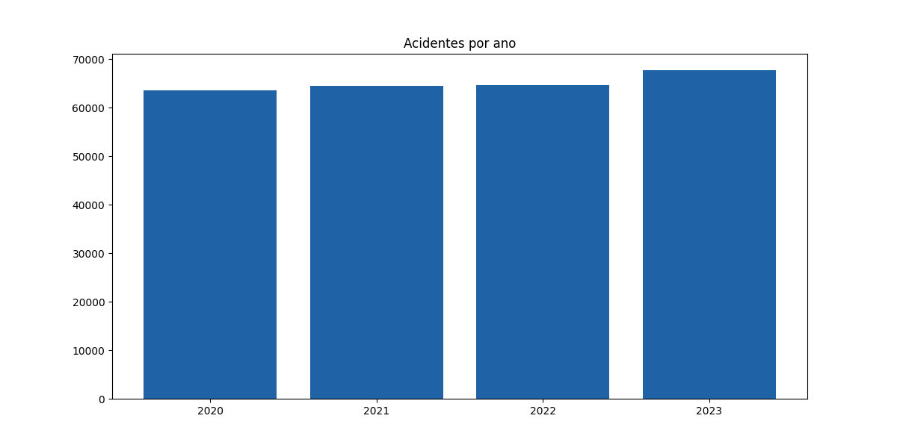

A distribuição mensal dos acidentes revela que nos meses de janeiro, julho, outubro e dezembro há um aumento no número de acidentes, **relacionado aos períodos de férias e festas de fim de ano**.

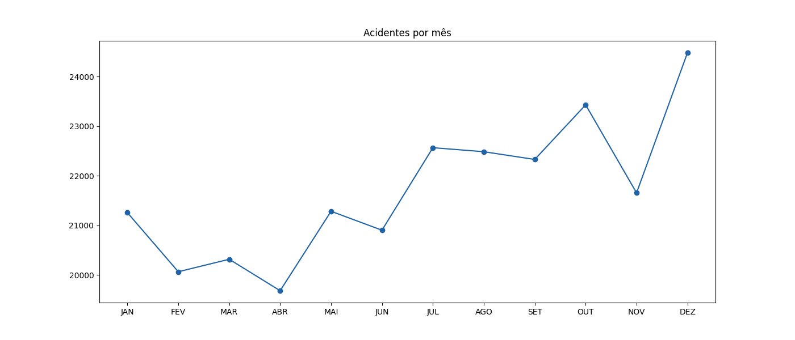

Esse padrão fica mais evidente quando o gráfico é segmentado por ano. Além disso, observa-se que a tentativa de "*lockdown*" em 2020 resultou em uma queda no número de acidentes a partir de março. No entanto, após julho, os números voltaram a subir.

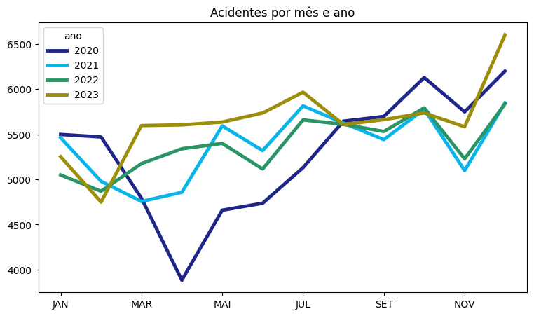

Analisando os dias da semana, percebe-se que os **finais de semana** (sábado e domingo) têm um maior número de acidentes, o que pode estar relacionado ao aumento do fluxo de veículos nas rodovias. A sexta-feira também apresenta um número elevado de acidentes.

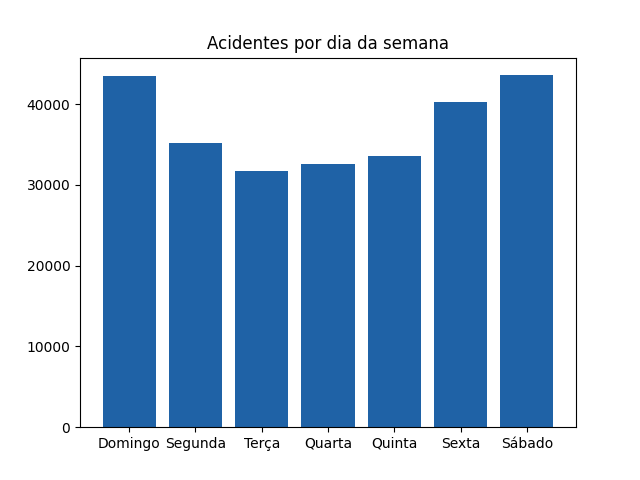

Mantendo sempre a mesma tendência independente do ano.

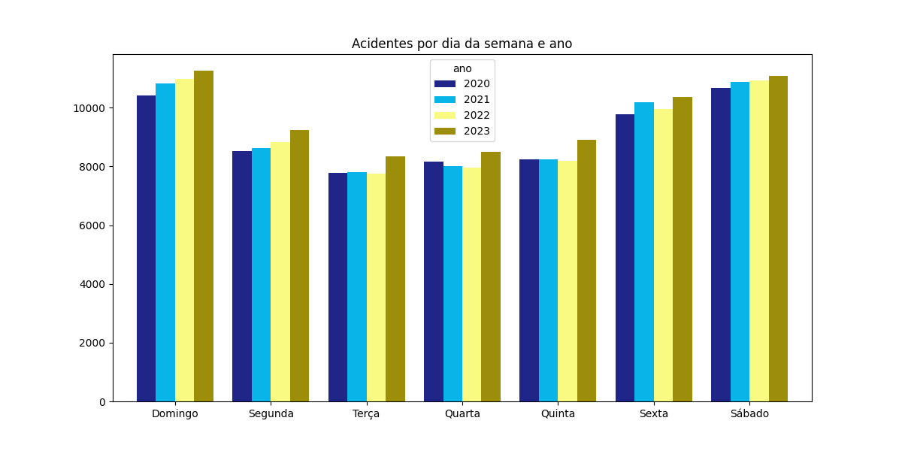

Os horários de pico para acidentes são entre 16h e 19h, o que pode estar relacionado ao horário de saída do trabalho e ao aumento do fluxo de veículos nas rodovias.

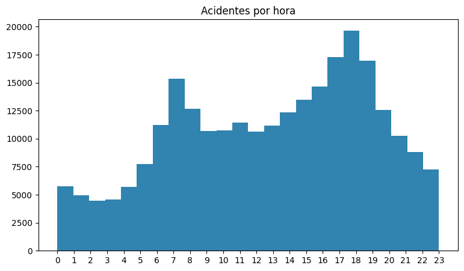

Entretanto, os horários que apresentam **maior gravidade são entre 22h e 5h**. Esse aumento na gravidade pode estar relacionado a diversos fatores, como falta de visibilidade, cansaço e ingestão de álcool, além das pistas mais livres, permitindo que os veículos atinjam maiores velocidades.

A tabela a seguir apresenta os 5 horarios com maior taxa de mortalidade de cada ano analisado.

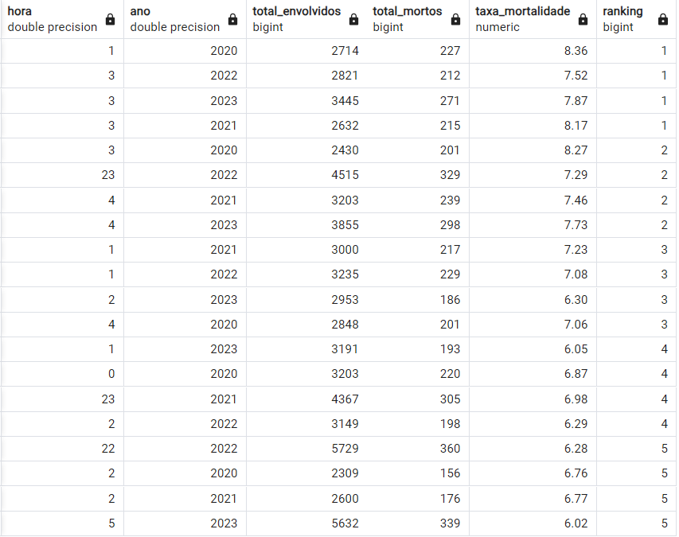

**Regionalização**

A região com maior número de acidentes é a região sudeste, seguida pela região sul e nordeste. Já a região norte é a que possui o menor número de acidentes.

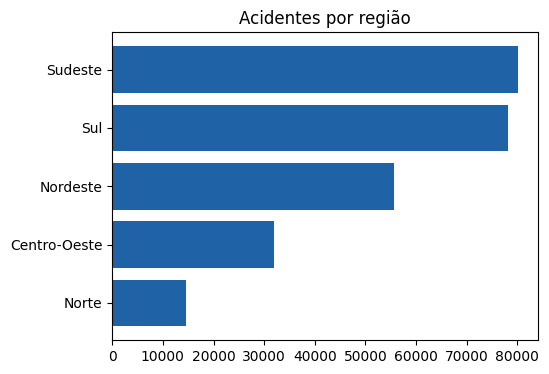

Porém, a **região nordeste é a que possui a maior taxa de mortalidade**, seguida pela região norte e centro-oeste. Já a região sul é a que possui a menor taxa de mortalidade.

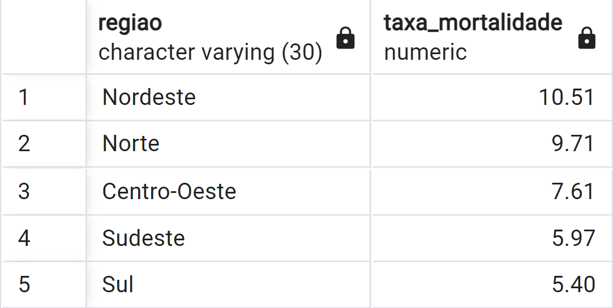

Olhando para os estados, Minas Gerais é o estado com o maior número de acidentes, seguido por Santa Catarina e Paraná. Já os estados do norte possuem o menor número de acidentes, pois possuem uma menor densidade populacional e menor fluxo de veículos, o que influencia diretamente no número de acidentes. Além da possibilidade de subnotificação de acidentes.

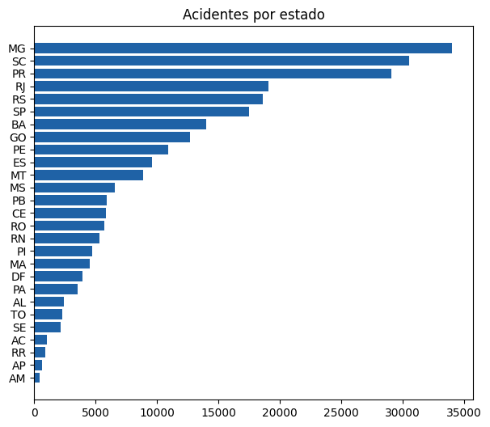

No entanto, os estados do norte e nordeste apresentam mais que o dobro de taxa de mortalidade em relação aos estados do sul e sudeste. Isso pode estar relacionado a diversos fatores, como a qualidade das rodovias, a falta de sinalização, a imprudência dos motoristas e a falta de atendimento médico adequado.

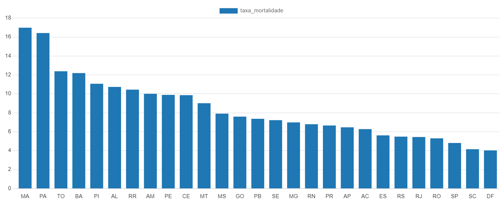

Olhando para os 10 municipios com maior número de acidentes, é possível observar que a maioria deles estão localizados na região sudeste, seguido pela região sul e nordeste.

As BRs com maior número de acidentes são a BR-116, BR-101, BR-040 e BR-381, que são rodovias que cortam diversos estados possuem um grande fluxo de veículos. Porém essas rodovias não são as que possuem a maior taxa de mortalidade.

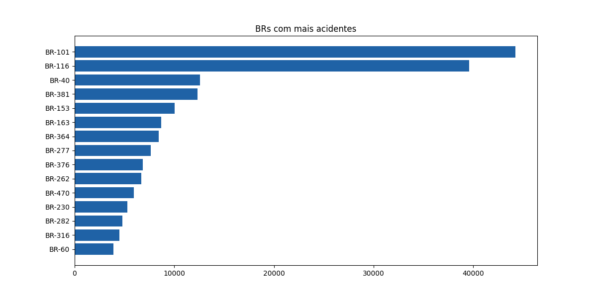

### **Causas de acidentes**

Os tipos de acidentes mais comuns são a colisão traseira, colisão lateral e colisão frontal, que são acidentes que podem ocorrer em diversas situações, como ultrapassagens indevidas, desrespeito à sinalização e excesso de velocidade.

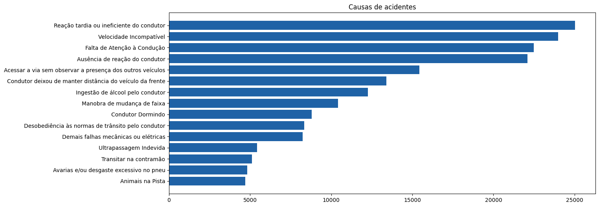

Porém é possível observar que os acidentes com maior taxa de mortalidade são causas por descuidos dos motoristas e pedestres, podendo ser evitados com mais atenção e cuidado.

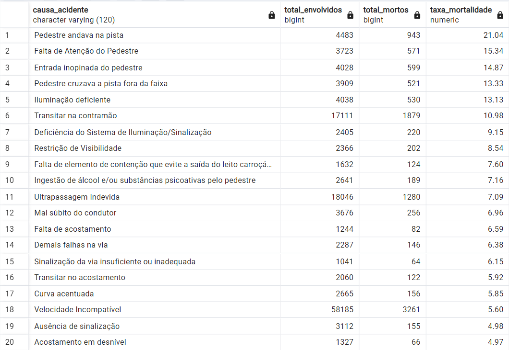

### **Tipos de acidentes**

Os tipos de acidentes mais comuns são a colisão traseira, saída da pista e tombamento, que são acidentes que podem ocorrer em diversas situações, como falta de atenção, ultrapassagens indevidas, desrespeito à sinalização e excesso de velocidade.

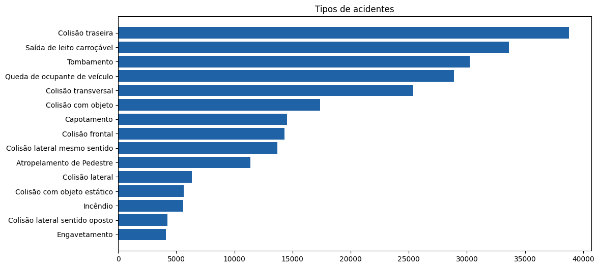

Porém é possível observar que os acidentes com maior taxa de mortalidade são os atropelamentos e colisão frontal, que são acidentes que podem ser mais graves e fatais.

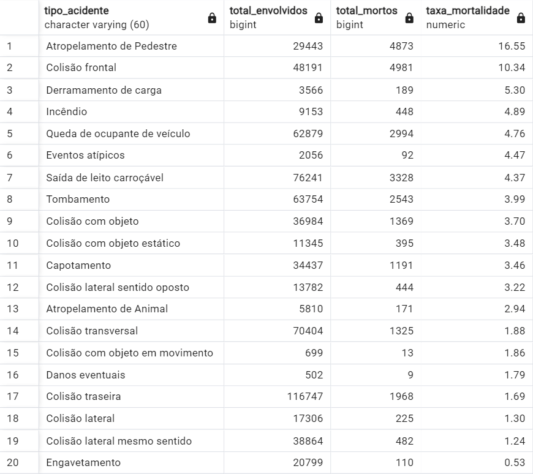

### **Características dos acidentes mais graves**

Depois de analisar diversas variáveis é possível concluir que **os acidentes mais graves são aqueles que envolvem pedestres**, visto que os pedestres são mais vulneráveis e podem sofrer lesões graves e fatais em caso de acidentes. Contudo, os acidentes que envolvem **falhas na sinalização/iluminação deficiente possuem altas taxas de mortalidade**, pois podem causar confusão e desorientação dos motoristas, aumentando o risco de acidentes. Podendo ser evitados com uma melhor manutenção e sinalização das rodovias.

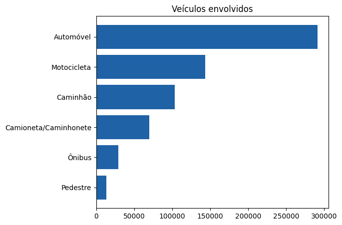
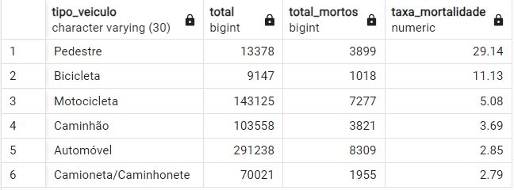

Ademais, é possível observar que os acidentes causados por imprudência dos motoristas, como **ultrapassagens indevidas, excesso de velocidade e desrespeito à sinalização**, possuem altas taxas de mortalidade, pois aumentam o risco de acidentes graves e fatais. Portanto, é fundamental que os motoristas respeitem as leis de trânsito e adotem uma direção defensiva para evitar acidentes.

O perfil dos envolvidos nos acidentes mais graves é de **homens entre 25 e 40 anos**, que são os mais propensos a se envolver em acidentes de trânsito, entretanto, a idade não é um fator determinante para a gravidade dos acidentes, visto a faixa etária não tem uma grande variação entre os acidentes graves e não graves. 

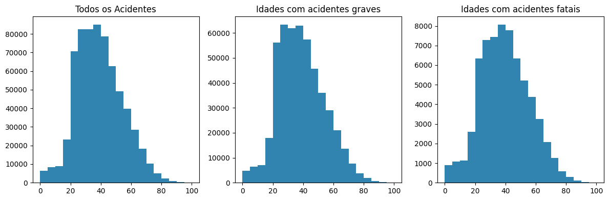

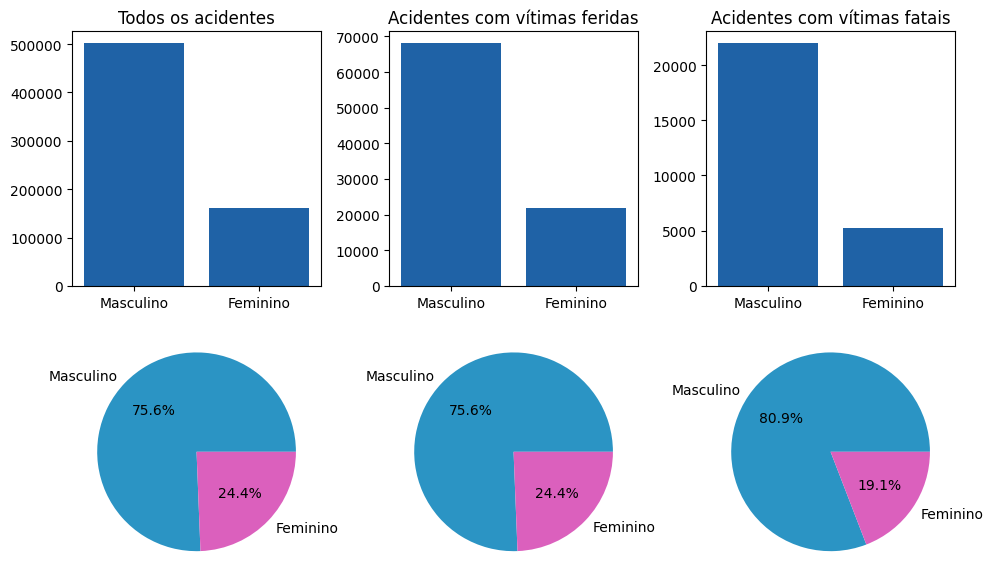

## **Machine Learning**

Um modelo de machine learning foi aplicado para prever a gravidade dos acidentes, com base nas características dos acidentes. Para isso, foram utilizadas técnicas de pré-processamento de dados, seleção de features e treinamento do modelo.

O modelo utilizado foi o **XGBoost**, que é um algoritmo de aprendizado de máquina baseado em árvores de decisão, que é eficiente e preciso para a classificação de dados. 

Motivo da escolha do modelo:

- **Eficiência**: O XGBoost é um algoritmo eficiente e rápido, que pode lidar com grandes volumes de dados e realizar previsões em tempo real, utilizando técnicas de otimização e paralelização. Visto que o dataset possui aproximadamente 1 milhão de registros, o XGBoost é uma escolha adequada para lidar com a complexidade dos dados.

- **Precisão**: O XGBoost é um algoritmo preciso e robusto, que pode lidar com dados desbalanceados e ruidosos, e realizar previsões com alta acurácia e confiabilidade, melhorando a qualidade das previsões e reduzindo o erro do modelo. Pois a classe de acidentes com vítimas fatais é uma classe bem menor em relação aos acidentes sem vítimas fatais.

- **Facilidade de uso**: O XGBoost é um algoritmo fácil de usar e implementar, que possui uma ampla documentação e suporte da comunidade, facilitando o desenvolvimento e a manutenção do modelo.

- **Hiperparâmetros**: O XGBoost possui diversos hiperparâmetros que podem ser ajustados para otimizar o desempenho do modelo, como a profundidade da árvore, a taxa de aprendizado e o número de estimadores, permitindo a personalização do modelo de acordo com as características dos dados.

#### **Metodologia**

O modelo foi treinado com as seguintes features:

- Região
- Tipo de acidente
- Causa do acidente
- Tipo de veículo
- BR
- Hórario

Foram utilizadas técnicas de pré-processamento de dados, como a codificação de variáveis categóricas, a normalização de variáveis numéricas e a divisão dos dados em treino e teste. Além disso, foi realizada a seleção de features para identificar as variáveis mais relevantes para a previsão da gravidade dos acidentes.

O modelo foi avaliado com base na acurácia e validado com a técnica de validação cruzada, para garantir a generalização do modelo e evitar o overfitting. O modelo obteve uma acurácia de 85%, o que indica que é capaz de prever a gravidade dos acidentes com alta precisão.

[Link para o código do modelo](https://github.com/saulo-duarte/Projeto-Acidentes-Rodovias-Federais/blob/main/notebooks/Classificacao.ipynb)

## **Conclusão**

A análise dos dados de acidentes em rodovias federais do Brasil revelou diversos insights e padrões interessantes, que podem ser utilizados para a prevenção de acidentes e a redução da taxa de mortalidade. Além disso, a aplicação de técnicas de machine learning permitiu prever a gravidade dos acidentes com base nas características dos acidentes, o que pode ser útil para identificar os fatores de risco e adotar medidas preventivas.

Grande parte dos acidentes não são fatais, **sendo causados por descuidos e falta de atenção dos motoristas**, podendo ser evitados com mais atenção e cuidado. Resultando em colições traseiras, saídas de pista e tombamentos. Porém, os acidentes mais graves são aqueles que envolvem **pedestres, falhas na sinalização e imprudência dos motoristas**, que podem ser evitados com uma melhor infraestrutura e fiscalização das rodovias.

Portanto, é fundamental que os motoristas respeitem as leis de trânsito, adotem uma **direção defensiva e estejam atentos às condições das rodovias** para evitar acidentes e preservar vidas. Além disso, é importante que as autoridades competentes invistam em **melhorias na infraestrutura das rodovias**, principalmente nas regiões do norte e nordeste, que apresentam as maiores taxas de mortalidade.

Medidas como **asfaltar áreas sem pavimentação, melhorar a qualidade do asfalto existente, além de aprimorar a sinalização e a iluminação das rodovias são essenciais**. Adicionalmente, **investir em fiscalização é crucial** para a prevenção de acidentes, punição de motoristas imprudentes, identificação rápida de acidentes, prestação de socorro eficiente e a correção de trechos com falhas de infraestrutura.

Por fim, é importante que as **campanhas de conscientização** e educação no trânsito **sejam intensificadas**, principalmente nas **regiões com maiores índices de acidentes e mortes**, e nos **períodos de férias e festas de fim de ano**, quando o fluxo de veículos é maior e o risco de acidentes é elevado.